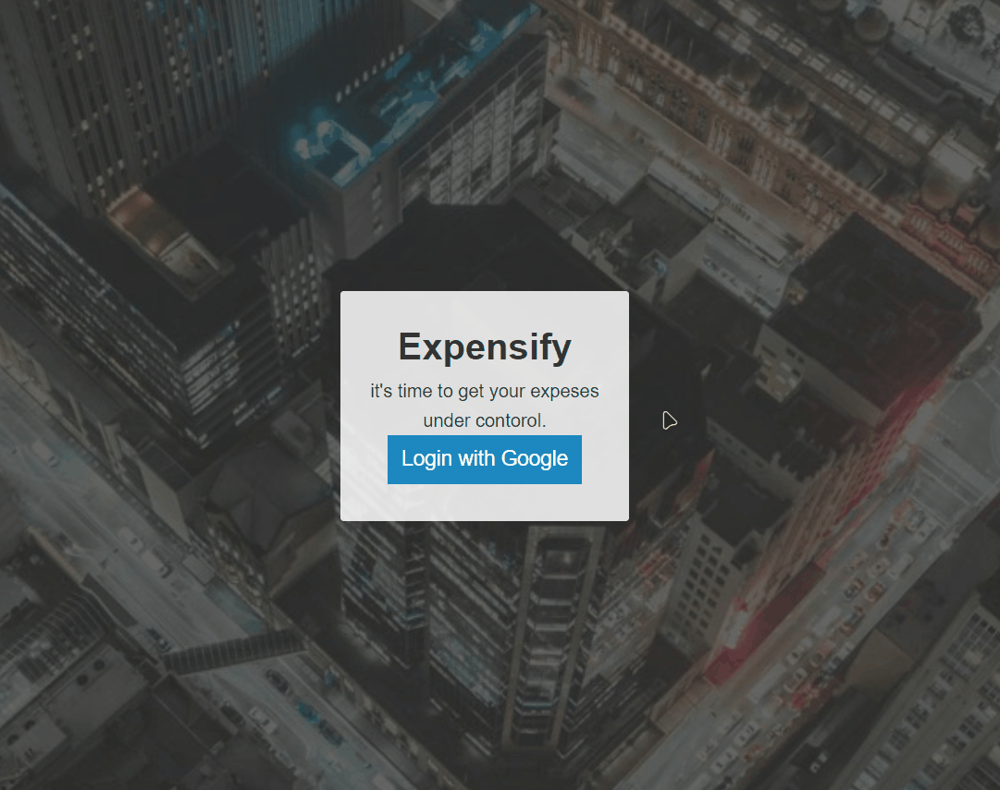

<h1 align='center'>Expensify  App</h1>

<p align="center">
    
      
    


</p>



## **Take look at 👇**

## [Live demo](https://xed-expensify.netlify.app/)✨

## Get your own clone

To clone and run this application, you'll need [Git](https://git-scm.com) and you are ready to use it !

```bash
# Clone this repository
$ git clone git@github.com:KhaledGharib/expensifyApp.git

# Go into the repository
$ cd expensifyApp

# Install dependencies
$ npm install

# Run build
$ npm run build

# Run the server
$ npm run server
```

> **Or you can use `npm run dev-server`**
